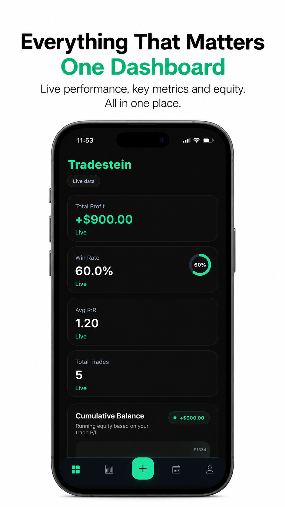

<h1 align="center">Rodrick</h1>

  Software developer building practical mobile and web products.

  
  
  

About

I turn product ideas into functional applications, from interface design and mobile development to authentication, databases, analytics, and production releases.

My current focus is JavaScript, TypeScript, React, React Native, and backend services.

Featured project

<table>
  <tr>
    <td width="34%" align="center">
      
    </td>
    <td width="66%" valign="top">
      <h3>Tradestein</h3>
      

        An iOS trading journal that helps traders review their performance,
        understand their behaviour, and build better discipline.
      

      
<strong>What it includes</strong>

      <ul>
        <li>Structured trade journaling</li>
        <li>Performance, risk, and equity analytics</li>
        <li>Trading calendar and progress tracking</li>
        <li>Discipline and psychology scoring</li>
        <li>Strategy-aware AI coaching</li>
      </ul>
      

        <strong>Built with:</strong> 
        React Native · Expo · TypeScript · Supabase · PostgreSQL
      

      
    </td>
  </tr>
</table>

Technologies

  
  
  
  
  
  
  
  
  

Currently

Improving Tradestein based on real product feedback

Strengthening my React, React Native, and full-stack development skills

Open to frontend, JavaScript, React, and React Native opportunities

Contact

  
  
  

